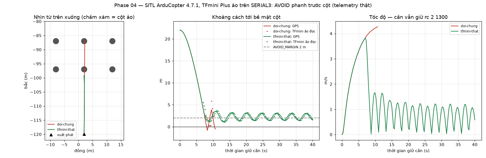
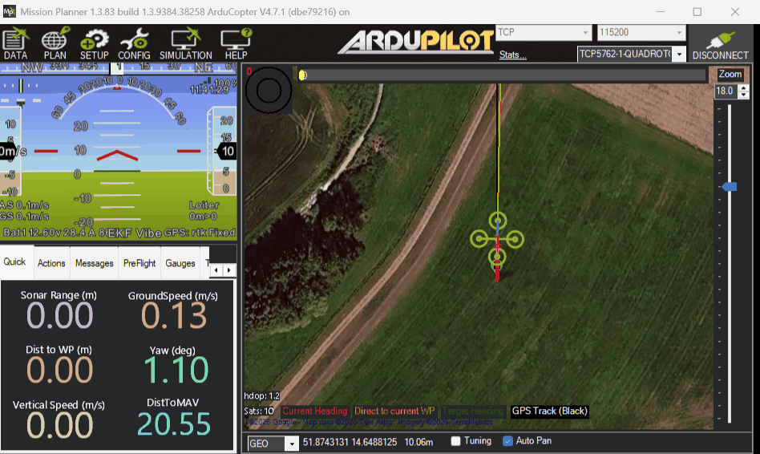

# Sổ tay 04-param-va-tranh-vat-can-ao

Trang này ghi lại việc nạp thử bộ param của dự án vào drone ảo (SITL) và thử
tránh vật cản bằng **TFmini Plus ảo**. Mọi con số dưới đây đều là số đo thật,
sinh bởi hai script trong `scripts/sitl/`. Bảng "SITL nhận / từ chối" nằm ở
[`firmware/ardupilot/params/sitl/README.md`](../../firmware/ardupilot/params/sitl/README.md).

> Dự án chỉ có **một** cảm biến khoảng cách: Benewake TFmini Plus, đã mua, gắn
> trên SERIAL3, nhìn thẳng về phía trước. Plan gốc có bài thử lidar 360° LD06 và
> rangefinder analog; hai bài đó đã bỏ theo quyết định của chủ dự án
> (25/09/2026) vì không có phần cứng tương ứng. Thay vào đó SITL có sẵn bộ mô
> phỏng `benewake_tfmini`, nên ta thử **đúng** cấu hình sẽ chạy trên drone thật.

## 1. Param là gì, snapshot là gì

Flight controller có khoảng **1370** công tắc nhỏ gọi là param (đếm thật trên
ArduCopter 4.7.1 SITL). Mỗi param là một cặp `TÊN,giá_trị`: `FRAME_CLASS,1` nghĩa
là "khung loại 1 = quad", `AVOID_MARGIN,2` nghĩa là "giữ cách vật cản 2 m".

**Snapshot** là ảnh chụp toàn bộ bảng param tại một thời điểm, lưu ra file. Luật
bất di bất dịch: **lưu snapshot trước khi đổi bất cứ thứ gì**. Nghịch hỏng mà
không có snapshot thì không có đường lùi.

Quy ước tên trong `firmware/ardupilot/params/`: `00-after-flash` → `01-base` →
… → `07-final`, số tăng theo mốc. Snapshot của SITL để **riêng** trong
`params/sitl/`, vì SITL có những param board thật không có (mọi thứ bắt đầu bằng
`SIM_`) và những giá trị chỉ đúng cho mô phỏng. Để lẫn là sớm muộn cũng chép
nhầm sang board thật.

## 2. Bốn nhóm param KHÔNG BAO GIỜ nạp bằng file

**Nạp bằng file là đo cỡ giày của người khác rồi bắt chân mình đi vừa.** Bốn nhóm
sau là số đo của chính con drone của bạn, phải chạy wizard trong Mission Planner:

| Nhóm param | Wizard | Vì sao |
|---|---|---|
| `RC*_MIN` / `MAX` / `TRIM` | Radio Calibration | Số đo **tay điều khiển của bạn** |
| `COMPASS_OFS*`, `COMPASS_DIA*` | Compass Calibration | Từ trường **tại chỗ lắp của bạn** |
| `INS_ACC*` | Accel Calibration | Gia tốc kế **của con board của bạn** |
| — | ESC Calibration | Dải xung **của bộ ESC của bạn** |

## 3. Custom build là gì, và vì sao phải biết trước param nào phụ thuộc nó

Chip F405 trên SpeedyBee không đủ bộ nhớ để nhét mọi tính năng của ArduPilot.
Bản firmware "stock" bỏ bớt; bản **custom build** dựng riêng ở
`custom.ardupilot.org` bật lại đúng những gì dự án cần (TFmini, proximity, OA),
file nguồn là `firmware/ardupilot/custombuild/speedybeef4v5-copter471-tfminiplus.yaml`.

SITL thì khác: nó chạy trên máy tính, không thiếu chỗ, nên bật gần như **mọi
thứ**. Hệ quả: một param SITL **nhận** chưa chắc board thật có. Ngược lại, một
param SITL **từ chối** có thể vẫn có trên board, vì có vài tính năng chỉ tồn
tại trên phần cứng thật. Cả hai chiều đều đã gặp ở phase này, xem mục 8.

## 4. Rangefinder khác proximity thế nào

```text
  Rangefinder (TFmini Plus)          Proximity (hệ tránh vật cản)

        drone ──────────▶ │            ╲   │   ╱
          một tia 3,6°    │ tường        ╲ │ ╱
          đo MỘT hướng                ─── drone ───   chia 8 cung 45°,
                                         ╱ │ ╲        mỗi cung một khoảng cách
                                       ╱   │   ╲
```

- **Rangefinder**: một tia, đo khoảng cách theo **một** hướng. TFmini Plus là một
  rangefinder: `RNGFND1_TYPE 20`, `RNGFND1_ORIENT 0` (0 = thẳng trước).
- **Proximity**: hệ con của ArduPilot giữ bản đồ "quanh drone có gì, cách bao xa"
  theo các cung. Tránh vật cản (`AVOID_*`) đọc từ proximity, **không** đọc thẳng
  từ rangefinder.
- Cầu nối là `PRX1_TYPE 4` = "lấy rangefinder làm nguồn cho proximity". Không có
  dòng này thì TFmini đo được nhưng AVOID không biết gì về nó.

Với một tia nhìn thẳng trước, proximity chỉ có dữ liệu ở **đúng một cung**. Bảy
cung còn lại là "không biết". Điều đó quyết định mục 6.

## 5. Ba giá trị `RNGFND1_TYPE` hay bị chép nhầm

| `RNGFND1_TYPE` | Nghĩa | Dùng ở đâu |
|---|---|---|
| `1` | Analog | Rangefinder analog ảo của SITL. **Dự án không dùng** |
| `100` | SITL ghép với trình mô phỏng ngoài (AirSim…) | Không dùng |
| `20` | Benewake TFmini Plus qua UART | **Board thật, và cả SITL** — vì SITL có bộ mô phỏng `benewake_tfmini` |

Dự án chỉ có TFmini Plus, nên giá trị duy nhất đúng là **`20`**, trên cả SITL lẫn
drone thật. Hai giá trị kia ghi ra đây chỉ để nhận ra khi gặp trong tài liệu
ArduPilot, đừng chép theo.

## 6. AVOID khác OA path planner — hai cơ chế, hai nhóm mode

| | AVOID (`AVOID_*`) | OA path planner (`OA_TYPE`) |
|---|---|---|
| Làm gì | **Phanh** (hoặc trượt dọc) trước vật cản | **Tìm đường vòng** qua vật cản |
| Chạy ở mode | LOITER, PosHold (AltHold: xem mục 10) | AUTO, GUIDED, RTL |
| Dự án | Bật: `AVOID_ENABLE 3` | Tắt: `OA_TYPE 0` |

**Vì sao `OA_TYPE 0` trên drone thật.** Hãy tưởng tượng đi trong phòng tối với
**một** cây đèn pin chiếu thẳng trước. Bạn thấy trước mặt có tường, nhưng không
biết bên trái có gì. "Vòng sang trái" lúc đó là đánh cược. BendyRuler (`OA_TYPE 1`)
làm đúng việc đánh cược ấy: nó lách sang hướng **chưa có dữ liệu**. TFmini là cây
đèn pin đó. Chỉ khi có cảm biến nhìn được nhiều hướng thì mới nên bật.

## 7. `AVOID_MARGIN`, `AVOID_DIST_MAX`, `AVOID_BEHAVE`, `AVOID_BACKUP_SPD`

```text
 drone ─────────────▶                              │ cột
                      │◀──── AVOID_DIST_MAX 5 m ──▶│
                      │   bắt đầu hãm dần   │◀ 2 m ▶│
                                            AVOID_MARGIN: vùng không được vào
```

- `AVOID_DIST_MAX 5`: vật cản gần hơn 5 m thì bắt đầu giới hạn tốc độ lao tới.
- `AVOID_MARGIN 2`: điểm dừng, giữ cách bề mặt vật cản 2 m.
- `AVOID_BEHAVE 1` = **Stop** (dừng hẳn). `0` = **Slide** (trượt dọc theo vật cản).
  Với một tia thì Slide vô nghĩa, vì không biết vật cản chạy theo hướng nào.
- `AVOID_BACKUP_SPD 0.75`: lỡ lấn vào margin thì **lùi ra** tối đa 0,75 m/s. Chính
  param này tạo ra kiểu dao động tới–lùi đo được ở mục 9.

## 8. Cửa sổ so sánh param của Mission Planner, và vì sao phải reboot

Khi `Load from file`, Mission Planner hiện một cửa sổ so sánh: mỗi dòng có giá
trị cũ, giá trị mới, và dòng nào **không tìm thấy** trên drone. Dòng "không tìm
thấy" có ba nghĩa rất khác nhau, và phase này gặp đủ cả ba:

1. **Chưa xuất hiện, sẽ có sau reboot.** `RNGFND1_ORIENT`, `RNGFND1_MIN`,
   `RNGFND1_MAX` chỉ hiện ra sau khi đã đặt `RNGFND1_TYPE` **và** khởi động lại.
   Lần nạp đầu chúng báo "không tìm thấy", nhìn vào tưởng firmware thiếu tính
   năng. Cách xử lý: nạp, `reboot`, **nạp lại lần hai**.
2. **Firmware này không biên dịch nó vào.** `AVOID_ANG_MAX` (xem mục 10).
3. **Chỉ có trên phần cứng thật.** `SERVO_BLH_POLES`, `SERVO_BLH_TRATE` (xem `params/sitl/README.md`).

Vì sao phải reboot: một số param chỉ được đọc **lúc khởi động**, đặc biệt
`SERIAL*_PROTOCOL` (cổng nào nói giao thức gì) và `*_TYPE` của cảm biến (có khởi
tạo driver hay không). Đặt xong mà không reboot thì giá trị đã ghi nhưng chưa có
tác dụng.

## 9. Kết quả: TFmini Plus ảo làm drone phanh trước cột



*Đồ thị vẽ từ telemetry MAVLink thật của hai chuyến bay SITL, do
`scripts/sitl/run_avoid_brake.py` sinh ra.*



*Ảnh chụp Mission Planner 1.3.83 nối vào cùng phiên SITL (TCP 5762), lúc drone
đang bị giữ trước cột trong khi script vẫn giữ `rc 2 1300`: mode **Loiter**, cao
10,06 m, cách điểm cất cánh **20,55 m** (bề mặt cột ở 22 m), tốc độ mặt đất
0,13 m/s. Cột ảo không hiện trên bản đồ MP: chúng chỉ tồn tại trong bộ mô phỏng.*

⚠️ **Ô "Sonar Range" hiện 0.00 dù TFmini đang thấy cột ở ~1,5 m, và đó là đúng.**
Mission Planner đọc ô này từ gói MAVLink `RANGEFINDER`, mà ArduPilot chỉ gửi gói
đó cho rangefinder **nhìn xuống** (`find_instance(ROTATION_PITCH_270)` trong
`GCS_Common.cpp`). TFmini của dự án nhìn thẳng trước (`RNGFND1_ORIENT 0`) nên ô
này **luôn** 0 trên drone thật. Muốn xem số TFmini: màn Proximity của Mission
Planner, hoặc gói `DISTANCE_SENSOR`. Đừng nhìn ô Sonar Range rồi kết luận cảm
biến hỏng.

**Bài thử.** SITL dựng sẵn một lưới cột ảo (20×20 cột, bán kính 1 m, cách nhau
10 m). Drone cất cánh ở phía nam lưới, thẳng hàng với một cột, cách bề mặt cột
22 m, lên 10 m, vào **LOITER**, rồi giữ cần tiến `rc 2 1300` suốt 40 giây. Hai
chuyến bay giống hệt nhau, chỉ khác một param:

- **Đỏ, đối chứng, `AVOID_ENABLE 0`:** lao thẳng **xuyên qua** cột ở ~4 m/s.
  Chuyến này bắt buộc phải có. Không có nó thì "drone đã dừng" có thể do bất cứ
  lý do nào khác (cần không vào, LOITER không nhận lệnh…), đúng cái bẫy đã gặp
  thật ở mục 10.
- **Xanh, nguyên file avoid của dự án:** tăng tốc tới 3,8 m/s, bắt đầu hãm khi
  còn ~5 m, **không bao giờ vượt cột**, gần nhất là **1,01–1,12 m**, dù cần vẫn giữ
  nguyên.

*Số đo lặp lại qua **4 lần bay** ngày 25/09/2026 (hai lần chạy `run_avoid_brake.py`,
hai lần bay dài 180 s và 240 s khi chụp Mission Planner). Mọi con số dưới đây là
khoảng giá trị qua các lần đó, không phải một lần may mắn.*

**Ba điều cần mang sang Phase 22 (drone thật):**

1. **Lấn vào margin khoảng 1 m.** Margin 2 m nhưng lao tới ở 3,8 m/s thì drone
   vào tới 1,01–1,12 m trước khi dừng được. Bay thật nên đi chậm khi gần vật cản, hoặc
   tăng `AVOID_MARGIN`.
2. **Không đứng yên mà dao động tới–lùi** trong khoảng 1,4–3,2 m, chu kỳ ~4 s,
   biên độ không tăng. Lý do: `AVOID_BACKUP_SPD 0.75` cho lùi khi lấn vào margin,
   cần vẫn đẩy tới, nên hai lực thay nhau thắng. Đây là lỗi (2) plan đã dự đoán
   ("phanh rồi lùi lại liên tục"). Trên SITL nó vô hại. Trên drone thật thì chỉnh
   ở Phase 22: thử giảm `AVOID_BACKUP_SPD` hoặc tăng `AVOID_BACKUP_DZ`, **đo lại**,
   đừng chỉnh đoán.
3. **TFmini đọc trễ khi bay nhanh.** Lúc đứng gần cột, số TFmini ảo lệch trung
   bình 0,28–0,36 m so với khoảng cách thật tính từ GPS. Lúc lao 4 m/s thì lệch
   1,61–1,64 m. Cảm biến thật cũng có độ trễ, nên thêm một lý do để bay chậm gần vật cản.

## 10. Log nạp param, và năm cái bẫy SITL đã gặp thật

Log `run_param_load.py` (rút gọn, chỉ giữ các dòng KHÔNG "nhận" ngay):

```text
[param_load] snapshot gốc: 1370 tham số
[param_load] SERVO_BLH_POLES      14         -> TỪ CHỐI — không tồn tại
[param_load] SERVO_BLH_TRATE      10         -> TỪ CHỐI — không tồn tại
[param_load] RNGFND1_ORIENT       0          -> TỪ CHỐI — không tồn tại
[param_load] RNGFND1_MIN          0.1        -> TỪ CHỐI — không tồn tại
[param_load] RNGFND1_MAX          6          -> TỪ CHỐI — không tồn tại
[param_load] AVOID_ANG_MAX        10         -> TỪ CHỐI — không tồn tại
[param_load] RNGFND1_ORIENT       xuất hiện sau reboot -> nhận, nhưng chỉ sau reboot
[param_load] RNGFND1_MIN          xuất hiện sau reboot -> nhận, nhưng chỉ sau reboot
[param_load] RNGFND1_MAX          xuất hiện sau reboot -> nhận, nhưng chỉ sau reboot
base:SERIAL5_BAUD [nhận lúc nạp, FC TỰ ĐỔI sau reboot: nạp 19 -> 115]
KET QUA: PASS
```

Bảng đầy đủ và ý nghĩa từng dòng: `firmware/ardupilot/params/sitl/README.md`.

Năm cái bẫy, cả năm đều **im lặng**: làm sai thì hỏng, mà không có thông báo nào
chỉ vào nguyên nhân.

| Bẫy | Triệu chứng | Nguyên nhân (đọc mã nguồn, rồi chạy thật để xác nhận) |
|---|---|---|
| Nạp base xong SITL mất GPS | `GPS fix=0 sats=0`, `EKF3 waiting for GPS config data` | GPS ảo của SITL nằm cứng ở SERIAL3; base đặt SERIAL3 = rangefinder. Chạy SITL với `--serial4=GPS1` |
| Bộ param dự án không arm được trên SITL | `PreArm: RC not found` | `RC_PROTOCOLS 4` (chỉ iBUS) tắt luôn RC ảo "SITL UDP". Board thật thì 4 là đúng |
| Giữ cần tiến ở LOITER mà drone đứng yên rồi tụt xuống đất | `SIM Hit ground at 2.45 m/s` | ArduPilot **bỏ qua** RC override không đến từ sysid của GCS (255). Harness cũ nối bằng 250, nên `square_via_rc()` của Phase 03 chưa từng có tác dụng. Đã sửa trong `harness.py` |
| Nối thêm Mission Planner thì script báo drone "đang STABILIZE" ngay sau khi arm | `takeoff(10.0) cần mode GUIDED hoặc AUTO, hiện đang STABILIZE` | ArduPilot chuyển tiếp HEARTBEAT của MP (loại GCS, `custom_mode = 0` = STABILIZE) sang cổng của script. Harness đọc gói HEARTBEAT kế tiếp mà không lọc nguồn. Đã sửa: chỉ nhận HEARTBEAT từ sysid của drone |
| Hai cảm biến ảo mà chỉ một hoạt động | cảm biến đầu biến mất, không báo lỗi | Lặp cờ `-A` thì cờ sau đè cờ trước. Gộp một chuỗi: `SITL_DEVICES="--serial3=... --serial4=..."` trong `scripts/run_sitl.sh` |

**Hai chỗ plan ghi sai, đo thật mới biết:**

- Plan viết "AVOID chạy ở LOITER / PosHold / AltHold". Phần AltHold (tránh vật cản
  không cần GPS, param `AVOID_ANG_MAX`) **không được biên dịch** trong bản 4.7.1
  mặc định. Phase 14 kiểm trên board thật.
- Công thức rangefinder analog của plan (`SIM_SONAR_SCALE 10` + `RNGFND1_TYPE 1`)
  thiếu `RNGFND1_PIN 0` và `RNGFND1_SCALING`. Không thử chạy, vì dự án không dùng
  rangefinder analog; ghi lại để ai đọc plan gốc khỏi mất công.

## Tự chạy lại

Trong WSL, lần lượt (không song song):

```bash
cd /mnt/d/Coding/IOT-CV
~/venv-ardupilot/bin/python3 scripts/sitl/run_param_load.py   # ~5 phút, ghi 00/01
~/venv-ardupilot/bin/python3 scripts/sitl/run_avoid_brake.py  # ~6 phút, ghi 02 + đồ thị
```

Muốn tự lái bằng Mission Planner với đúng cấu hình TFmini:

```bash
SITL_DEVICES="--serial3=sim:benewake_tfmini --serial4=GPS1" \
SITL_EXTRA="-l 51.8741286,14.6488121,54.15,0" ./scripts/run_sitl.sh
```

Toạ độ đó là điểm xuất phát của runner, cách cột ảo gần nhất 22 m về phía bắc.
Nhớ `param set SIM_SONAR_ROT 0`, nạp file avoid, `reboot`, rồi nạp lại file avoid
lần hai (mục 8).
