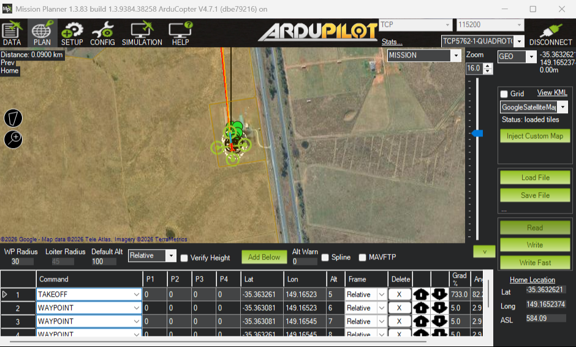
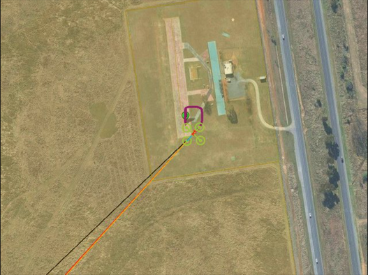

# Sổ tay 07-backend-mission-proximity-safety

Trang này ghi lại Phase 07: backend nạp mission xuống flight controller, đọc khoảng
cách vật cản, gom mọi phản ứng an toàn vào một bảng, và phát một luồng video giả để
Phase 10 dựng giao diện. Mọi con số là số đo thật trên SITL ArduCopter 4.7.1 ngày
25/09/2026; lệnh chạy lại nằm ở cuối trang.

## 1. Mission protocol là một cuộc hỏi đáp

Nạp mission không phải "đẩy một danh sách xuống". Nó là một cuộc hỏi đáp:

```text
Backend -> FC   MISSION_COUNT(7)          "tôi có 7 item"
FC -> Backend   MISSION_REQUEST_INT(0)    "cho tôi item 0"
Backend -> FC   MISSION_ITEM_INT(0)
FC -> Backend   MISSION_REQUEST_INT(1)    "cho tôi item 1"
Backend -> FC   MISSION_ITEM_INT(1)
      ...                                  (FC có quyền hỏi LẠI một số cũ)
FC -> Backend   MISSION_ACK(ACCEPTED)     "nhận đủ"
```

Điều dễ sai nhất: **trả lời theo số FC hỏi, không theo bộ đếm của mình.** Gói rơi
trên Wi-Fi thì FC hỏi lại item 2; ai trả bằng bộ đếm riêng sẽ gửi item 3 vào ô số 2,
và từ đó cả mission lệch một dòng. Test `test_fc_hoi_lai_seq_cu` dựng đúng cảnh này.

Mỗi lần chờ FC tối đa 2 s, im lặng thì gửi lại `MISSION_COUNT`, tối đa 3 lần. Hai
lần nạp chồng nhau bị chặn bằng khoá: lần thứ hai nhận `command_denied` ngay. Khoá
này đã được thử thật một cách tình cờ: hai script cùng chờ máy bay lên 4 m rồi cùng
gửi mission, một cái nạp được, cái kia bị từ chối đúng như thiết kế.

## 2. Vì sao phải đọc lại

FC trả `ACK` nghĩa là nó **nhận**. Nó không nghĩa là nó **giữ đúng cái ta gửi**. Sau
mỗi lần nạp, backend đọc ngược cả mission từ FC và so từng item (toạ độ lệch tối đa
1e-7 độ, độ cao 0,1 m, `command` phải trùng). Chỉ khi khớp, `mission.source` mới là
`readback`; UI Phase 09 chỉ vẽ mission khi `source == "readback"`.

Nguyên tắc chung, dùng được ở mọi chỗ: **khi có thể hỏi lại nguồn sự thật, đừng hiển
thị bản sao trong bộ nhớ mình.**

## 3. Vì sao `seq 0` là home, và vì sao kiểm bằng Mission Planner

ArduPilot coi item số 0 là ô HOME. Nếu bỏ ô đó và gửi TAKEOFF ở số 0, takeoff bị
nuốt vào ô home và mission mất lệnh cất cánh. Backend luôn gửi một bản sao home ở
số 0 (FC tự ghi đè), rồi item của người dùng từ số 1.

Kiểm bằng **Mission Planner**, không bằng chính backend: nối MP vào cổng 5762 của
SITL, vào PLAN → Read. Kết quả đọc thẳng từ FC:

| Dòng | Lệnh | Vĩ độ | Kinh độ | Cao | Frame |
|---|---|---|---|---|---|
| 1 | TAKEOFF | -35.363261 | 149.16523 | 5 | Relative |
| 2 | WAYPOINT | -35.363081 | 149.16523 | 6 | Relative |
| 3 | WAYPOINT | -35.363081 | 149.16545 | 7 | Relative |
| 4 | WAYPOINT | -35.363261 | 149.16545 | 8 | Relative |
| 5 | WAYPOINT | -35.363361 | 149.16534 | 6 | Relative |
| 6 | RETURN_TO_LAUNCH | 0 | 0 | 0 | Absolute |

Đúng từng số với `plans/samples/mission-4wp.json`, không lệch dòng nào. Một hệ thống
tự khẳng định về chính nó thì chưa chứng minh gì; một phần mềm khác đọc ra cùng kết
quả mới là bằng chứng. RTL hiện frame "Absolute" vì với lệnh không có toạ độ, FC trả
frame 0 — không phải nạp sai (đã gặp từ Phase 03).



## 4. `frame` là gì

Mỗi item có một `frame` nói độ cao tính từ đâu. `frame = 6` là **so với chỗ cất
cánh** — khớp với `relative_alt` trên HUD. `frame = 0` là so với **mực nước biển**.
Sân CMAC của SITL cao 584 m so với mực nước biển: gửi "5 m" với frame 0 là bảo máy
bay xuống lòng đất 579 m, còn Mission Planner hiện những con số gấp hàng trăm lần mong
đợi. Backend cố định `frame = 6` cho mọi item bay.

## 5. Hai luật mới, và vì sao backend không tự chèn

- Item đầu phải là `NAV_TAKEOFF`: Copter **không** tự cất cánh trong AUTO. Thiếu nó
  thì mission "chạy" mà máy bay nằm im.
- Item cuối phải là `RTL` hoặc `LAND`: mission hết giữa trời thì Copter treo tại
  điểm cuối cho tới hết pin.

Backend báo lỗi, **không** tự chèn: chèn takeoff là tự quyết độ cao cất cánh, chèn
RTL là tự quyết máy bay về đâu. Hai quyết định đó thuộc về người.

Mission có một waypoint 50 m bị trả `validation_failed: WP3: altitude 50.0 m vượt
giới hạn 10.0 m` và **không một gói nào** đi xuống FC (lịch sử sự kiện chỉ có tiến độ
của lần nạp trước). REST trả mã 422.

Geofence phần mềm (`MAX_ALT`, `MAX_DISTANCE_HOME`) chỉ bắt lỗi **gõ nhầm**. Lớp thật
là `FENCE_*` trên FC (Phase 19): backend chết thì geofence của backend chết theo,
geofence của FC thì không.

## 6. Rangefinder khác proximity — và SITL thật sự gửi gì

Rangefinder là **một tia** đo khoảng cách. Proximity là "bản đồ 360° quanh máy bay".
Dự án chỉ có một TFmini Plus nhìn thẳng trước, góc 3,6°, nên 7 trong 8 cung luôn
trống. UI phải vẽ đúng như vậy, không vẽ vòng tròn đầy đủ gây hiểu lầm.

Đo trên SITL với đúng bộ param dự án (`scripts/sitl/run_proximity_probe.py`), trước
khi viết một dòng code:

| Câu hỏi | Plan đoán | Đo thật |
|---|---|---|
| Gói khoảng cách nào tới? | `DISTANCE_SENSOR` + `OBSTACLE_DISTANCE` | Chỉ `DISTANCE_SENSOR`, một nguồn: id 10, orientation 0, 10–600 cm |
| Bit sức khoẻ ở `SYS_STATUS`? | (bit rangefinder) | `LASER_POSITION` 0x100 **không có mặt**; `PROXIMITY` 0x4000000 có mặt, khoẻ |
| AVOID phanh có báo STATUSTEXT? | "chưa xác minh" | **0 dòng** — phanh im lặng |

Nếu lấy sức khoẻ từ bit rangefinder hiển nhiên thì `rangefinder_healthy` luôn False
và `avoid_state` luôn UNKNOWN — cùng kiểu bẫy `ekf_ok` ở Phase 05. Không đo thì
không biết.

`OA_TYPE = 0` (đường tránh tự lách của FC đang tắt) là cố ý: với một tia 3,6° nhìn
thẳng, BendyRuler sẽ lách sang hướng nó chưa hề có dữ liệu.

## 7. AVOID chỉ chạy ở Loiter / AltHold / PosHold

`AVOID_ENABLE = 3` (AC_Avoid) chỉ can thiệp ở ba mode Loiter, AltHold, PosHold. Ở
AUTO, GUIDED, RTL, việc tránh thuộc về path planner — mà ta đang tắt. Nghĩa là **ở
AUTO và GUIDED, hệ thống KHÔNG tránh vật cản.** `avoid_state` ở các mode đó tối đa
là `NEAR`, không bao giờ `ACTIVE`, và UI Phase 10 phải nói rõ "chế độ này CHƯA tránh
vật cản". Một panel im lặng ở đây là một lời nói dối về an toàn.

| `avoid_state` | Khi nào |
|---|---|
| `OFF` | Có số đo xa hơn 5 m; hoặc cảm biến khoẻ mà FC không gửi số đo nào (không có gì trong 6 m) |
| `NEAR` | 2–5 m; hoặc dưới 2 m nhưng ở mode AC_Avoid không chạy |
| `ACTIVE` | Dưới 2 m **và** đang Loiter/AltHold/PosHold — FC đang phanh |
| `UNKNOWN` | FC báo cảm biến không khoẻ, mất link MAVLink, hoặc số đo mới nhất là số rác |

**Nghiệm thu trên SITL** (`scripts/sitl/run_backend_avoid.py`): cùng lưới cột ảo và
TFmini ảo của Phase 04, backend nghe qua cổng 5763, ghi `avoid_state` theo thời gian.

| Chặng | Lần 1 (theo plan) | Lần 2 (sau khi sửa) |
|---|---|---|
| Bay trống, cách cột 23 m | **UNKNOWN** 40/40 | OFF 40/40 |
| LOITER, giữ cần tiến | UNKNOWN → OFF → NEAR → ACTIVE, rồi NEAR/ACTIVE xen nhau, gần nhất 1,04 m | OFF → NEAR → ACTIVE, rồi NEAR/ACTIVE xen nhau, gần nhất 1,05 m |
| GUIDED, velocity tiến | xuống 1,51 m, **không lần nào ACTIVE** | xuống 1,53 m, **không lần nào ACTIVE** |

NEAR/ACTIVE xen nhau ở LOITER là FC phanh rồi lùi (`AVOID_BACKUP_SPD`), đúng dao
động đã đo ở Phase 04. UNKNOWN xuất hiện đúng lúc: 38 mẫu khi SITL vừa khởi động lại
và FC chưa báo cảm biến khoẻ.

Lần 1 lộ ra hai chỗ sai, cả hai đều **pytest không thấy** vì test tự dựng luồng số
đo liên tục:

- **Trời trống bị báo "mù".** FC **chỉ gửi** `DISTANCE_SENSOR` khi có vật trong tầm
  (proximity bỏ qua cung không có số hợp lệ). Plan coi im lặng quá 2 s là UNKNOWN,
  nên cả chặng bay trống báo UNKNOWN trong khi bit sức khoẻ khoẻ suốt. Cảnh báo "mù"
  hiện suốt ngày thì người dùng quen tai rồi bỏ qua đúng lúc nó cần. Sửa: khoẻ mà im
  lặng là OFF; mù thật thì FC tắt bit sức khoẻ.
- **Mất link mà vẫn báo trống.** 63 mẫu `connected=false` mà `avoid_state=OFF`, dựa
  trên cờ khoẻ cuối cùng của một link đã chết. Sửa: mất link là UNKNOWN.

## 8. "Không biết" khác "không có vật cản"

Cảm biến trả giá trị ở đầu dưới tầm đo (≤ 10 cm) nghĩa là **không đọc được**, không
phải "sát vật cản". Backend trả `null`, không trả `0.0`: một UI hiện "0.0 m" khi cảm
biến đang mù là cách gây tai nạn. Số đo cũ hơn 2 s cũng bị che thành `null` — một
con số mét đứng im trên màn hình là một lời nói dối về khoảng cách.

Nhưng "không có số" không tự động là "mù". Mục 7 cho thấy FC im lặng khi trời
trống. Thứ phân biệt hai trường hợp là **bit sức khoẻ do chính FC báo** và **link còn
sống**, không phải việc có số hay không.

Ngược lại, giá trị ở đầu trên tầm (≥ 600 cm) là một câu trả lời thật: "trong 6 m
không có gì". Nó ra `OFF`, không ra `UNKNOWN`; gộp cả hai thành "mù" thì cứ bay giữa
trời trống là UI báo không biết.

## 9. Vì sao backend KHÔNG BAO GIỜ tự đổi flight mode

Đây là quyết định kiến trúc, không phải sự lười. Năm lý do:

1. **ArduPilot đã có failsafe, và nó nằm đúng chỗ.** `FS_GCS_ENABLE`,
   `FS_EKF_ACTION`, failsafe pin chạy **trên FC** — nơi vẫn hoạt động khi Wi-Fi
   chết, laptop sập, backend crash. Failsafe đặt ở backend chỉ bảo vệ được đúng
   những tình huống backend còn sống, tức là những tình huống **ít nguy hiểm nhất**.
2. **Hai tác nhân tự quyết sinh tranh chấp.** Backend gửi RTL trong khi phi công
   vừa gạt sang LOITER để né cái cây: máy bay làm theo lệnh đến sau, mà không ai
   đoán được lệnh nào đến sau.
3. **Rớt Wi-Fi 2.4 GHz vặt là chuyện bình thường.** Một backend tự kích RTL mỗi lần
   rớt gói sẽ tự tạo ra tai nạn từ một sự cố vô hại.
4. **Zero-velocity KHÔNG phải là đổi mode.** Nó là việc backend *rút lại lệnh do
   chính nó phát ra*; GUIDED tự giữ vị trí. Một bên là ngừng can thiệp, bên kia là
   can thiệp thêm.
5. **RC là dây cứu sinh** (`SAFETY.md` mục 4). Khi mọi thứ hỏng, người cầm RC phải
   giành lại được máy bay. Backend tự đổi mode làm giả định đó yếu đi.

Bảng đầy đủ "sự kiện → backend LÀM / KHÔNG LÀM" nằm ở đầu khối Phase 07 trong
`backend/mavlink/safety.py`; mỗi dòng có một test trong
`test_safety_state_machine.py`, và mỗi test khẳng định **cả cột KHÔNG LÀM**: sau sự
cố không có gói đổi mode, arm/disarm, RTL/LAND hay mission nào đi ra.

Thử thật: tắt SITL khi máy bay đang AUTO ở 6 m. Backend báo `link.lost` mức error sau
3,1 s, `connected=false` sau 3,3 s (`LINK_TIMEOUT_S = 3`), không đổi mode, không crash,
`/api/health` vẫn 200, và tự thử nối lại.

## 10. Geofence phần mềm chỉ là lớp phụ

Nhắc lại cho khỏi quên (`SAFETY.md` mục 8): giới hạn trong `config.py` chặn lỗi gõ,
geofence trên FC mới chặn máy bay. Phase 19 bật geofence thật.

## 11. Coverage không bằng chất lượng test — bốn phép thử phá

Coverage 93% cho `safety` + `mission` + `deadman` + `proximity`. Con số đó chỉ nói
"đã chạy qua bao nhiêu dòng". Câu hỏi đúng là: **nếu thứ này hỏng, có test nào đỏ
không?** Bốn phép thử, mỗi phép sửa tạm một dòng rồi chạy lại toàn bộ test
(25/09/2026):

| # | Sửa tạm | Kết quả |
|---|---|---|
| 1 | `should_send_zero_velocity()` → `return False` | 7 test đỏ |
| 2 | `validate_mission()`: `>` thành `>=` ở kiểm tra `max_alt` | **0 test đỏ** lần đầu → thêm test biên độ cao đúng bằng 10 m → 1 test đỏ |
| 3 | `type_mask` `0x0DC7` → `0x0DC6` | 2 test đỏ |
| 4 | `avoid_state` bỏ điều kiện mode ở nhánh ACTIVE | 6 test đỏ |

Phép 2 là bài học: coverage của `mission.py` là 90%, dòng kiểm `max_alt` được chạy
qua hàng chục lần, vậy mà đổi dấu so sánh không test nào phát hiện — vì không test
nào thử đúng giá trị biên. Mọi sửa tạm đã hoàn nguyên (kiểm bằng `git diff` rỗng).

## 12. Hai lỗi chỉ lộ khi chạy thật, pytest xanh toàn bộ

**HEARTBEAT của Mission Planner bị coi là của máy bay.** ArduPilot chuyển tiếp gói
giữa các cổng. Khi MP nối cổng 5762, heartbeat của nó (sysid 255, loại GCS,
custom_mode 0) cũng tới cổng của backend. Backend đọc nó thành "mode STABILIZE, chưa
armed" xen với heartbeat thật của máy bay: mode nhảy GUIDED ↔ STABILIZE mỗi giây,
`start()` báo "Chưa armed" trong khi máy bay đang bay ở 4 m. Ngoài hiện trường, MP và
web cùng nối là cấu hình chuẩn của dự án, và mode nhảy như vậy làm backend tưởng phi
công gạt RC nên thu quyền lái vô cớ. Sửa: thread đọc bỏ mọi gói không đến từ sysid
của FC; `update_state` bỏ heartbeat loại GCS. Sau khi sửa, cả chuyến AUTO với MP nối
suốt: chuỗi mode chỉ có `AUTO`.

**Đóng tab ngay sau lệnh takeoff thì takeoff bị huỷ.** `plans/samples/takeoff.jsonl`
bật WEB CONTROL rồi đóng socket ngay sau `cmd.takeoff`. Dead-man gửi velocity 0
(đúng thiết kế Phase 06), mà trong GUIDED một setpoint velocity **huỷ** lệnh takeoff
đang chạy: máy bay nằm đất và tự disarm sau 10 s. Không phải lỗi Phase 07, và là hành
vi an toàn (dừng lại), nhưng người dùng cần biết: bật WEB CONTROL thì phải giữ tab mở
tới khi máy bay lên xong. Bài nghiệm thu AUTO chạy không bật WEB CONTROL (mode, arm,
takeoff không cần nó).

## 13. Vì sao có video giả

Tách việc dựng giao diện khỏi việc có camera. Camera thật chỉ có ở Phase 17, bộ nhận
diện thật ở `plans/ai/`, nhưng Phase 10 cần một luồng để dựng panel video và canvas
vẽ box ngay bây giờ. Nguyên tắc chung: dựng sẵn cái khuôn để khi hàng thật về chỉ
việc cắm vào.

- `backend/vision/stream.py` đọc **bất kỳ** URL MJPEG nào đúng hợp đồng
  `docs/hop-dong-mjpeg.md`, bằng parser viết tay: đọc header tới dòng trống, rồi đọc
  **đúng** `Content-Length` byte (JPEG là nhị phân, có thể chứa `\n` lẫn chuỗi
  `--frame`). Giữ duy nhất khung mới nhất, không hàng đợi.
- Mỗi tab trình duyệt đọc chung khung đó: ba tab vẫn chỉ **một** kết nối tới nguồn
  (test `test_nhieu_tab_dung_chung_mot_ket_noi_toi_nguon`).
- `backend/vision/fake_stream.py` là một nguồn như mọi nguồn khác: lặp clip mẫu, gắn
  đủ bốn header, và mỗi 300 ms một box giả chạy vòng quanh một hình chữ nhật. Box
  không cần khớp nội dung video; nó chỉ để kiểm canvas vẽ đúng chỗ.

Clip mẫu (`backend/vision/assets/sample-clip.mp4`, 640×480, 16 s) là vùng bản đồ vệ
tinh của Mission Planner quay lúc SITL đang bay mission, giống ảnh camera nhìn
xuống bám theo drone. Bản đầu quay cả cửa sổ MP rồi thu về 320×240: mở trong trình
duyệt thì bé và vỡ chữ. Nguồn giả giờ mặc định VGA 640×480, JPEG chất lượng 10 (thang
ESP32, số nhỏ là nét); QVGA vẫn đặt lại được bằng `CAMERA_FAKE_FRAMESIZE=QVGA`.



## Tự chạy lại

```powershell
# test + coverage
uv run pytest
uv run pytest --cov=backend.mavlink.safety --cov=backend.mavlink.mission --cov=backend.mavlink.deadman --cov=backend.mavlink.proximity --cov-report=term-missing --cov-fail-under=80

# SITL nền + backend
wsl -d Ubuntu --exec bash -lc 'cd /mnt/d/Coding/IOT-CV && bash scripts/sitl/sitl-headless.sh start'
$env:MAVLINK_ENDPOINT="tcp:127.0.0.1:5760"; uv run uvicorn backend.app:app

# nạp mission (mong đợi: ack done {"count":6,"readback_ok":true})
uv run python scripts/ws_probe.py --send-mission plans/samples/mission-4wp.json
# mission sai (mong đợi: validation_failed, không gói nào xuống FC)
uv run python scripts/ws_probe.py --send-mission plans/samples/mission-alt50-sai.json

# khoảng cách + avoid_state
uv run python scripts/ws_probe.py --filter telemetry --field obstacle_distance,avoid_state,rangefinder_healthy --count 60
# video giả + box giả
uv run python scripts/ws_probe.py --filter detection --count 5
Start-Process "http://127.0.0.1:8000/api/video/stream"
```

Trong WSL, đo lại dữ liệu proximity thật và bài AVOID qua backend:

```bash
~/venv-ardupilot/bin/python3 scripts/sitl/run_proximity_probe.py
~/venv-ardupilot/bin/python3 scripts/sitl/run_backend_avoid.py   # backend nối tcp:127.0.0.1:5763
```
