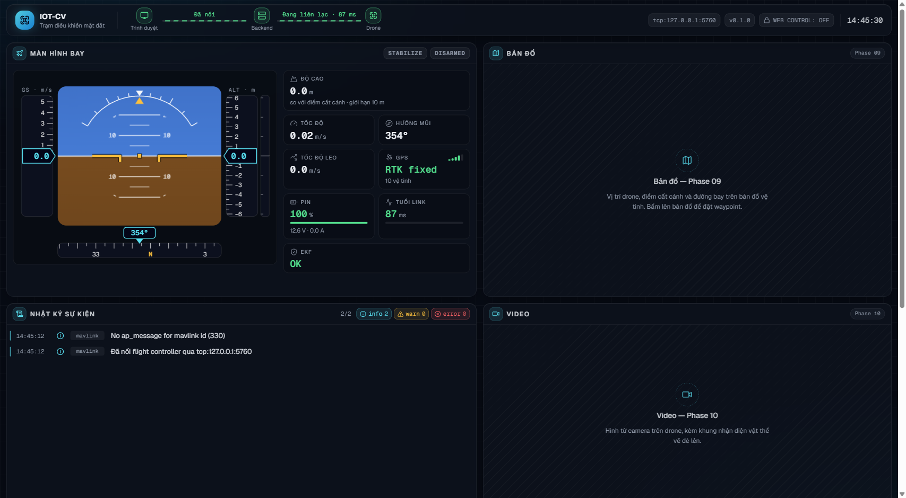
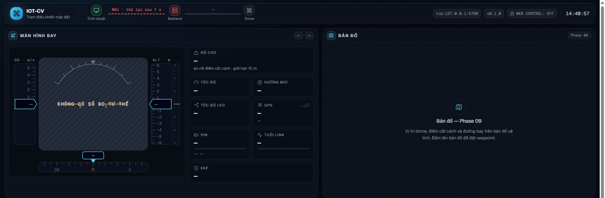
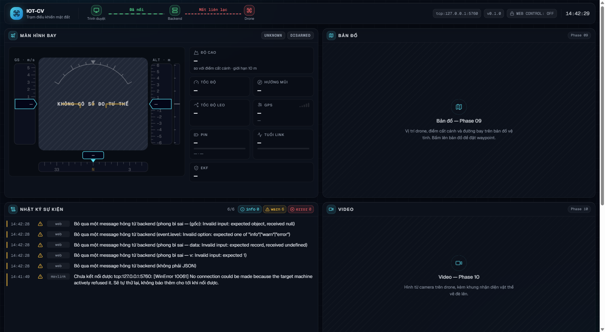

# Sổ tay 08-web-khung-hud

Trang này ghi lại Phase 08: dựng khung website trạm điều khiển mặt đất (GCS), nối
WebSocket tới backend, và hiện HUD telemetry. Chưa có bản đồ (Phase 09), chưa có
nút điều khiển (Phase 10): phase này chỉ **nhìn**, chưa chạm. Mọi số đo là số thật
trên SITL ArduCopter ngày 25/09/2026; lệnh chạy lại nằm ở cuối trang.



## 1. Vì sao Vite chứ không Next.js

Next.js giải bài toán ta không có: render phía server cho SEO, nhiều trang, route
động. GCS là **một trang**, chạy trong mạng LAN, không ai tìm nó trên Google. Next
còn đòi một tiến trình Node thứ hai chạy song song với FastAPI. Vite chỉ build ra
file tĩnh (`frontend/dist/`) và FastAPI phục vụ luôn — một tiến trình, một cổng.
(Báo cáo `plans/reports/260921-research-web-gcs-stack.md` §2.1.)

Cũng vì một trang nên **không có router**. Thêm router là thêm một khái niệm không
dùng tới.

## 2. Dữ liệu đẩy khác dữ liệu hỏi–đáp

| | Đẩy (WebSocket) | Hỏi–đáp (REST) |
|---|---|---|
| Ví dụ | telemetry 8 lần/giây, sự kiện | lịch sử sự kiện lúc mở trang |
| Ai bắt đầu | backend, bất cứ lúc nào | trình duyệt, khi cần |
| Công cụ | store `zustand` | `fetch` trần |

TanStack Query giỏi phần bên phải (cache, gọi lại, huỷ). Nhưng bên phải ta chỉ có
vài endpoint và không cần cache, nên **chưa cài** — thêm dependency cho có là thêm
thứ phải hiểu mà không được gì. Khi nào Phase 09/10 thật sự cần cache thì cài.

Store telemetry có một luật quan trọng: component lấy **đúng lát cắt** của nó,
`useTelemetryStore(s => s.telemetry?.relative_alt)`, không lấy cả store. Ở 8 Hz,
lấy cả store làm **mọi** ô trên màn hình vẽ lại 8 lần/giây kể cả khi số của nó
không đổi.

## 3. Bẫy `StrictMode` mount hai lần

Ở chế độ dev, React 19 cố tình chạy `useEffect` → dọn dẹp → `useEffect` lần nữa,
để lộ ra code quên dọn dẹp. Viết ngây thơ ("mở WebSocket trong effect") là có **hai**
WebSocket. Với dự án này nó nguy hiểm riêng: backend cho **một** socket giữ quyền
lái, nên ở Phase 10 tab sẽ tự giành quyền lái với chính nó và nhận `command_denied`
không rõ vì sao.

Cách chữa gồm hai lớp:

1. Effect **luôn** trả về `sock.close()`.
2. `createGcsSocket` mở kết nối **trễ một nhịp** (`setTimeout 0`). Lượt mount–dọn
   dẹp đầu tiên của StrictMode xảy ra liền nhau trong cùng một lượt, nên `close()`
   huỷ hẹn giờ trước khi kịp có kết nối nào.

Đã kiểm hai chiều ở `pnpm dev` (StrictMode bật): bọc hàm dựng `WebSocket` trong
trang để đếm, thấy **đúng 1** kết nối `/ws`; phía backend log `s-4 mở (tổng 1)`.
Rồi **cố ý phá** (gọi `connect()` ngay, bỏ nhịp trễ) thì đếm được **2**. Phép thử
đỏ được khi hỏng, nên con số 1 có nghĩa.

Lưu ý: DevTools ở dev còn thấy một WebSocket nữa tới `/?token=...` — đó là hot
reload của Vite, không phải của ta.

## 4. Hai loại "mất kết nối"

```text
[Trình duyệt] ──(1) WebSocket──> [Backend] ──(2) MAVLink──> [Drone / SITL]
```

Thanh trên cùng vẽ đúng chuỗi này, mỗi đoạn một màu riêng:

- **(1)** đỏ: trang không nói chuyện được với backend. Trang tự thử nối lại và hiện
  đếm ngược "thử lại sau N s".
- **(2)** đỏ: backend vẫn chạy nhưng không nghe drone. Khi (1) đã đỏ thì (2) hiện
  `—` (không biết), **không** đỏ — ta không biết gì về drone lúc đó.

Gộp thành một đèn thì khi mất kết nối không ai biết mất ở đoạn nào. Đo thật:
tắt SITL → đoạn (2) đỏ sau 1,9 s, đoạn (1) giữ xanh suốt, nhật ký có `link.lost`.



## 5. Vì sao `null` phải hiện `—`

"Chưa có số đo" khác "số đo bằng không". Ô độ cao hiện `0.0 m` khi thật ra chưa
nhận được gì là cách khiến người ta tin drone đang nằm đất. Cùng nguyên tắc với
`avoid_state = UNKNOWN` ở backend (Phase 07). Vì thế:

- mọi hàm định dạng trả `—` cho `null`/`undefined`/`NaN`;
- chân trời giả khi không có số đo vẽ nền xám "KHÔNG CÓ SỐ ĐO TƯ THẾ", không vẽ
  chân trời phẳng (phẳng trông như "đang cân bằng");
- mất WebSocket thì store **xoá** số sống, HUD về `—`, thay vì đứng im ở số cũ.

Một biến thể đã bắt được ở nghiệm thu: SITL nằm đất báo `relative_alt = -0.02`, và
`toFixed(1)` in ra **`-0.0`**. Giờ `formatNumber` không bao giờ in `-0`.

## 6. Vì sao không hardcode ngưỡng

Giới hạn an toàn (`max_alt`, `max_velocity`, `avoid_margin_m`…) do backend quyết,
đọc từ `.env`. Web đọc chúng qua `status.limits` (hook `useLimits`). Đổi `.env` là
UI đổi theo; không có chỗ thứ hai phải sửa. Ví dụ: vạch sọc vàng "trên giới hạn độ
cao" trên băng độ cao lấy từ `limits.max_alt`.

Ngưỡng **tô màu** (pin dưới 25 % thì đỏ, tuổi link trên 1 s thì vàng) không phải
giới hạn an toàn — đổi chúng không làm drone bay khác đi — nên được là hằng số có
tên (`DISPLAY_THRESHOLDS` trong `lib/format.ts`).

## 7. Hợp đồng và bản dịch

Bản gốc là mục "Hợp đồng WebSocket" trong `plans/phase-05-backend-mavlink-telemetry.md`.
Chuỗi từ gốc tới web không có bước nào gõ tay:

```text
hợp đồng Phase 05 → backend/schemas.py → backend/ws-contract.schema.json
    ├─ pnpm gen:protocol → src/lib/protocol.generated.ts   (type TypeScript)
    └─ z.fromJSONSchema() lúc chạy                         (kiểm dữ liệu từ mạng)
```

Type TypeScript biến mất khi biên dịch, nên không bảo vệ gì trước một message hỏng
đến từ mạng. Lớp kiểm lúc chạy dựng **thẳng** từ JSON Schema, nên không có bản zod
gõ tay nào để trôi khỏi hợp đồng.

Test `protocol.test.ts` sinh lại file và so với bản đã commit. Đã thử phá (sửa một
dòng trong file sinh ra) và test đỏ đúng chỗ. Sửa bản dịch mà không sửa bản gốc là
cách chắc chắn để hai bên hiểu khác nhau.

Hợp đồng cho phép backend thêm `type` mới: web **bỏ qua trong im lặng** `type` lạ.
Còn message hỏng thì bỏ qua nhưng **ghi cảnh báo**: đo thật bằng cách chen 6 frame
rác vào đúng kết nối đang chạy → 5 dòng cảnh báo, frame `type` lạ im lặng, trang
không sập, socket vẫn xanh.



## 8. Nhịp tim của WebSocket

`readyState === OPEN` không chứng minh đường dây còn sống. Wi-Fi rớt, máy ngủ dậy:
socket vẫn "mở" trên giấy tờ mà không gì đi qua. Nên:

- cứ 2 s gửi `ping`;
- 5 s không nhận được **gì** (telemetry, pong, kể cả rác) → coi như chết, đóng và
  nối lại.

Nối lại chờ lâu dần 1 → 2 → 4 → 8 → 10 s (trần), cộng ngẫu nhiên 0–500 ms để nhiều
tab không cùng đập vào backend một lúc. Đo thật khi giết backend: đếm ngược hiện
2 → 1, 3 → 1, 5 → 1, 9 → … đúng dãy trên; bật backend lại thì trang tự nối trong
một nhịp và nhật ký ghi "Đã nối lại với backend".

## 9. Proxy lúc dev là gì

Lúc viết giao diện có hai cổng: Vite ở 5173 (tự tải lại khi sửa code), FastAPI ở
8000. Khối `server.proxy` trong `vite.config.ts` làm trình duyệt tưởng `/api` và
`/ws` nằm cùng cổng với trang. Nhờ vậy code chỉ dùng **đường dẫn tương đối**, không
chỗ nào biết số cổng: `grep -rn "127.0.0.1:8000\|localhost:8000" frontend/src` rỗng.

| Chế độ | Lệnh | Mở |
|---|---|---|
| Dev | `pnpm dev` + backend riêng | `http://127.0.0.1:5173` |
| Thật | `pnpm build` + backend | `http://127.0.0.1:8000` |

Thiếu `ws: true` trong proxy thì `/ws` báo 404 ở dev: proxy chỉ chuyển HTTP.

## 10. Thiết kế giao diện

Tông tối kiểu buồng lái (nền xanh đen, số liệu sáng màu), vì số sáng trên nền tối
là quy ước của mọi màn hình bay. Màu trạng thái dùng chung một bảng: xanh ổn, vàng
chú ý, đỏ nguy hiểm, cyan cho số liệu thường.

HUD là **màn hình bay chính (PFD)** như trên máy bay thật: chân trời có thang pitch
và cung roll ở giữa, băng tốc độ bên trái, băng độ cao bên phải, cột tốc độ leo,
băng hướng mũi bên dưới. Mắt đọc **xu hướng** (thước đang trôi lên hay xuống) nhanh
hơn đọc con số nhảy. Các ô số (độ cao, GPS, pin…) nằm cạnh, mỗi ô có tooltip giải
thích cho người mới.

Bố cục đã đổi hai lần theo góp ý:

1. Bản đầu theo đúng hình vẽ của plan §8.1.3: HUD là cột hẹp bên trái. Trông sơ sài.
2. Bản thứ hai thêm PFD, nhưng khoá trang vào đúng một màn hình và ép HUD vào cột
   400 px, nên **trang không cuộn được** và HUD phải cuộn lồng trong ô.
3. Bản hiện tại: **cả trang cuộn**, không ô nào cuộn lồng (trừ danh sách nhật ký),
   màn hình bay rộng ngang bản đồ. Thanh kết nối dính trên cùng khi cuộn. Màn hẹp
   hơn 1280 px thì xếp một cột.

Các ô của Phase 09/10 đã có chỗ và ghi rõ sẽ chứa gì, để người xem demo không tưởng
giao diện hỏng.

## 11. Phiên bản đã dùng thật

`pnpm list --depth 0` ngày 25/09/2026. Bảng phiên bản trong plan (từ báo cáo stack)
đã lệch: `typescript 5.103.1` không tồn tại, bản thật là 6.0.3 (registry có 7.0.2
nhưng Phase 01 đã ghim `~6.0.2`).

| Gói | Bản |
|---|---|
| react / react-dom | 19.3.0 |
| vite | 8.3.0 |
| typescript | 6.0.3 |
| tailwindcss / @tailwindcss/vite | 4.3.3 |
| zustand | 5.0.15 |
| zod | 4.6.5 |
| sonner | 2.0.8 |
| lucide-react | 1.47.0 |
| @fontsource-variable/geist, geist-mono | 5.3.0 |
| vitest | 5.0.1 |
| jsdom | 30.1.1 |
| @testing-library/react | 16.3.3 |
| json-schema-to-typescript | 16.0.0 |
| oxlint | 1.83.0 |

## Chạy lại

```powershell
cd frontend
pnpm install --frozen-lockfile
pnpm test          # 43 test, 5 file
pnpm typecheck
pnpm lint
pnpm build
pnpm gen:protocol  # sau khi backend/ws-contract.schema.json đổi
```

Nghiệm thu với SITL (xem skill `iot-cv-sitl-nghiem-thu`):

```powershell
wsl -d Ubuntu --exec bash -lc 'cd /mnt/d/Coding/IOT-CV && bash scripts/sitl/sitl-headless.sh start'
$env:MAVLINK_ENDPOINT = "tcp:127.0.0.1:5760"; uv run uvicorn backend.app:app --host 127.0.0.1 --port 8000
# mở http://127.0.0.1:8000
```
