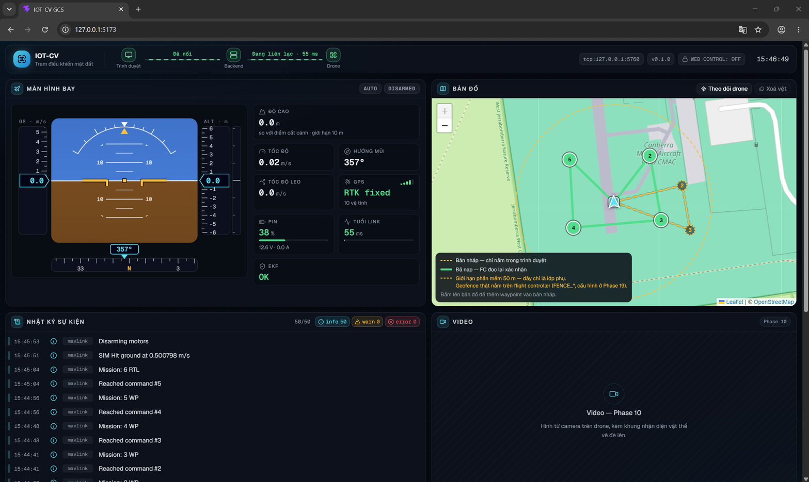

# Sổ tay 09-web-ban-do-mission

Trang này ghi lại Phase 09: cho website một **bản đồ sống** (drone, vệt đường, home,
vòng giới hạn) và một **trình soạn mission** (bấm hoặc vẽ để đặt waypoint, kiểm tra
tại chỗ, nạp xuống flight controller, hiển thị lại mission mà FC đọc ngược lên). Mọi
số đo là số thật trên SITL ArduCopter ngày 25/09/2026; lệnh chạy lại nằm ở cuối trang.


## 1. Kinh độ, vĩ độ và vì sao 7 chữ số thập phân

Một điểm trên Trái Đất là hai số: **vĩ độ** (lat, bắc–nam, −90..90) và **kinh độ**
(lon, đông–tây, −180..180). MAVLink không gửi số thực mà gửi **số nguyên đã nhân
1e7**: −35.3632621 đi trên dây là −353632621. Một đơn vị cuối ≈ 1 cm.

Vì vậy bảng mission hiện 6 chữ số (đủ cho mắt người, ~10 cm), còn chỗ nào lưu toạ độ
thì giữ 7 chữ số: thêm nữa là số giả, bớt đi là làm lệch điểm người dùng bấm.

Một bẫy cùng họ: **GeoJSON xếp `[lng, lat]`**, ngược với Leaflet và MAVLink. Nét vẽ
của `terra-draw` là GeoJSON, nên chỗ duy nhất đảo thứ tự là `routeToPoints` trong
`frontend/src/lib/geo.ts`, và có test riêng. Đảo nhầm thì waypoint rơi sang bán cầu
khác, hoặc thành toạ độ không hợp lệ.

## 2. Heading là gì

`heading` là hướng mũi máy bay, tính bằng độ: **0 = Bắc, tăng theo chiều kim đồng
hồ** (90 = Đông). CSS `rotate(…deg)` cũng xoay theo chiều kim đồng hồ từ hướng lên
trên, nên dùng thẳng, không đổi dấu.

Kiểm trên SITL: bay tới WP2, HUD báo 37°, đúng góc phương vị mà Mission Planner tính
cho chặng đó (cột AZ = 37); chặng sau 170°, lúc quay về 357°. Mũi tên trên bản đồ
chỉ đúng ba hướng đó.

Không có `heading` thì vẽ **chấm tròn không mũi**, không vẽ mũi chỉ lên Bắc: mũi chỉ
sai hướng tệ hơn là không có mũi.

## 3. Vì sao không tạo marker mới mỗi khung

Telemetry về 8 lần mỗi giây. Có hai cách cho marker drone đi theo:

- **Dời** marker cũ tới toạ độ mới (`setLatLng`).
- **Tháo** marker cũ ra khỏi bản đồ rồi **gắn** một marker mới.

Cách hai giống việc đập nhà xây lại mỗi lần muốn kê lại cái bàn: bản đồ giật, và
bộ nhớ rò dần. Trong React, lỗi này sinh ra từ một dòng trông vô hại —
`key={Date.now()}` hay `key={lat + lon}` trên `<Marker>` — vì khoá mới là React tháo
ra gắn lại. Luật được viết thành comment đầu `DroneMarker.tsx`.

Mũi tên xoay cũng không đổi icon: icon tạo **một lần**, và chỉ `style.transform`
của phần tử con được sửa. Không xoay phần tử ngoài, vì Leaflet dùng `transform` của
phần tử ngoài để đặt vị trí marker.

Test `map-mission.test.tsx` đếm số lần marker được gắn vào bản đồ qua 40 gói telemetry:
đúng **1**. Cố ý phá (thêm `key={lat-lon}`) thì đếm được **41** và test đỏ — phép thử
đỏ được khi hỏng, nên con số 1 có nghĩa.

## 4. Bản nháp khác mission thật

Có hai thứ rất dễ nhầm với nhau:

| | Bản nháp | Mission đã nạp |
|---|---|---|
| Nằm ở đâu | bộ nhớ trình duyệt | bộ nhớ flight controller |
| Ai biết | chỉ tab này | máy bay |
| Vẽ bằng | nét **đứt** vàng, marker **rỗng** | nét **liền** xanh lá, marker **đặc** to hơn |

Bấm bản đồ chỉ thêm vào bản nháp. Không gì xuống máy bay cho tới khi bấm **NẠP
MISSION**. Và lớp "đã nạp" chỉ được vẽ khi backend đã **đọc ngược** mission từ FC và
so khớp với cái vừa gửi (`status.mission.source == "readback"`). Toạ độ của lớp này
lấy qua `GET /api/mission`, vì `status` chỉ mang số lượng và nguồn, không mang toạ độ.

Vì sao phải đọc ngược lên mới tin: gửi xong không có nghĩa là FC giữ đúng cái đó. Gói
có thể rơi, FC có thể hỏi lại một item, một GCS khác có thể chen vào giữa. Chỉ bản đọc
lại mới là sự thật.

**Bài học đã gặp:** lúc đầu nét nháp mảnh (2 px) và nằm **dưới** nét đã nạp, vì Leaflet
vẽ lớp nào gắn sau thì nằm trên, và lớp đã nạp chỉ xuất hiện sau khi nạp xong. Sửa bản
nháp sau khi nạp thì nét nháp gần như biến mất. Giờ nét nháp có **pane riêng**
(`mission-draft`, z-index 450, trên overlay 400) nên luôn nằm trên, bất kể lớp nào gắn
trước.



## 5. Vòng giới hạn trên web chỉ là lớp phụ

Vòng tròn đứt nét quanh home có bán kính `status.limits.max_distance_home` (50 m). Nó
ngăn bạn **nạp** một mission có điểm ra ngoài vòng. Nó **không** ngăn **máy bay** bay
ra ngoài: backend chết, mất sóng, hay pilot gạt RC thì vòng này chẳng còn tác dụng gì.
Geofence thật là `FENCE_*` trên flight controller (Phase 19, `SAFETY.md` mục 8). Vì
vậy vòng tròn luôn đi kèm nhãn nói đúng điều đó.

**Quan sát trên SITL cần xử lý ở phase param:** trong chặng RTL, drone leo lên **15 m**
trước khi về, cao hơn trần phần mềm `max_alt` = 10 m. Đó là độ cao RTL của phiên SITL,
FC tự quyết, web và backend không can thiệp được. Muốn RTL không vượt trần thì phải
chỉnh param độ cao RTL cho khớp (xem nhật ký param ở Phase 04/11).

## 6. Vì sao mission phải bắt đầu bằng cất cánh và kết thúc bằng về nhà

- Copter **không tự cất cánh** trong AUTO. Mission không có item cất cánh thì bật AUTO
  lên, máy bay nằm im, và người mới chắc chắn tưởng code hỏng.
- Mission kết thúc giữa trời thì Copter **treo** ở điểm cuối tới khi hết pin.

Backend từ chối cả hai (luật 7–8) và **không tự chèn**: chèn cất cánh là tự quyết độ
cao, chèn RTL là tự quyết máy bay về đâu. Web thì làm chuyện đó không thể xảy ra: bảng
luôn có dòng **CẤT CÁNH** đầu và **VỀ NHÀ (RTL) / HẠ CÁNH** cuối, không xoá được, chỉ
sửa được. HẠ CÁNH gửi toạ độ (0, 0) = hạ ngay tại điểm cuối.

## 7. Seq phải liên tục

FC nhận mission theo số thứ tự item. Số nhảy cóc (1, 2, 4) là FC trả
`MAV_MISSION_INVALID_SEQUENCE`. Web không **lưu** seq: seq được đánh lại từ vị trí mỗi
lần dựng payload, nên xoá hay đổi thứ tự thế nào cũng luôn là 1..n.

Khoá của mỗi dòng trong React là một `id` ngẫu nhiên cố định, **không** phải chỉ số
mảng. Dùng chỉ số thì đổi thứ tự xong, ô nhập độ cao của dòng này hiện giá trị của
dòng kia.

## 8. Vì sao kiểm hai lần (web và backend)

| | Kiểm ở web | Kiểm ở backend |
|---|---|---|
| Để làm gì | phản hồi **ngay lúc gõ**, khoá nút NẠP kèm lý do | **cổng chặn thật** |
| Ai lách được | ai cũng lách được — script, tab khác, gửi thẳng WebSocket | không ai |

Không bên nào thay được bên kia. Bài nghiệm thu #10 gửi thẳng một mission thiếu cất
cánh qua `ws_probe` (không đi qua web): backend trả `validation_failed`, không có
`ack accepted` nào đứng trước, mission trên FC giữ nguyên.

Hai bản kiểm tra ở hai ngôn ngữ **sẽ** trôi khỏi nhau theo thời gian. Ba thứ giữ chúng
khớp:

1. Web soi gương **hành vi**, không chỉ tên luật: ngoài 8 luật trong plan còn luật
   **danh sách trắng lệnh** (chỉ 16/20/21/22 — không cho `DO_SET_SERVO`,
   `DO_MOTOR_TEST` từ web), và các ngoại lệ: RTL không kiểm toạ độ, CẤT CÁNH chỉ kiểm
   độ cao, HẠ CÁNH tại (0, 0) là hạ tại chỗ.
2. Không có ngưỡng nào trong `frontend/src`: mọi con số đọc từ `status.limits`.
3. `missionRules.test.ts` chạy **cùng bộ dữ liệu** với
   `backend/tests/test_mission_validation.py`, đọc thẳng giá trị mặc định trong
   `backend/config.py` và mã lệnh trong `backend/schemas.py`. Backend đổi số hay thêm
   luật mà quên web thì test đỏ.

Khi backend thêm luật 9, cổng pass của phase đó phải thêm luật 9 vào
`frontend/src/lib/missionRules.ts`.

Web còn kiểm thêm các điều kiện **máy bay** (không phải lỗi người soạn): chưa nối, GPS
chưa 3D fix, EKF báo hỏng, chưa có home. Khi đó nút NẠP khoá kèm lý do. Nhờ vậy, nếu
backend vẫn trả `validation_failed` cho một mission web cho qua, thì đó thật sự là dấu
hiệu hai bên đã lệch, và web ghi cảnh báo `mission.rules_drift` vào nhật ký.

## 9. Vệt đường lọc 2 m

GPS đứng yên vẫn nhảy lung tung vài chục cm. Ghi mọi điểm ở 8 Hz là 480 điểm mỗi
phút, vẽ ra một cục rối. Vệt chỉ thêm điểm khi drone đã dịch **hơn 2 m** so với điểm
cuối, tối đa 2000 điểm (cắt từ đầu), và **chỉ khi armed**.

Kiểm trên SITL: treo ở 5 m trong 90 giây, toạ độ chỉ dịch 1e-7 độ (~1 cm) và bản đồ
không có vệt nào; bay AUTO thì vệt phủ đúng các chặng đã bay, chặng chưa bay thì chưa
có. Lưu ý: GPS của SITL gần như không nhiễu, nên vế "lọc nhiễu thật ±0.5 m" do test
`geo.test.ts` phủ (480 gói nhiễu → vệt vẫn 1 điểm).

## 10. Vẽ lộ trình bằng terra-draw

Ngoài bấm từng điểm, nút **Vẽ lộ trình** cho vẽ một đường gấp khúc: bấm từng đỉnh, bấm
lại đỉnh cuối hoặc nhấn Enter để xong, Esc để huỷ nét. Nét xong thì mỗi đỉnh thành một
waypoint **nháp** và đi đúng một đường với điểm bấm tay: bảng, kiểm tra, nút NẠP. Vẽ
nhiều đỉnh hơn `max_waypoints` thì luật 6 báo lỗi, không cắt bớt im lặng.

Hai lỗi gặp thật khi thử trên trình duyệt, cả hai đều đã sửa và có comment trong
`RouteDrawControl.tsx`:

1. **Bán kính "bấm lại đỉnh cuối để xong" mặc định 40 px.** Ở zoom 17, 1 px ≈ 1 m, nên
   đỉnh mới nào cách đỉnh trước dưới ~40 m cũng bị hiểu là lệnh kết thúc; mission trong
   vòng 50 m không vẽ nổi quá 3 đỉnh. Giờ là 12 px.
2. **Cú bấm kết thúc lọt thành waypoint thừa.** terra-draw kết thúc nét ở `pointerup`;
   sự kiện `click` của cùng cú bấm tới sau. Tắt chế độ vẽ ngay thì cú click đó rơi vào
   "bấm để thêm điểm". Vẽ 3 đỉnh, bảng hiện 4. Giờ chế độ vẽ tắt ở tick sau.

## 11. Thanh tiến trình đếm cả ô home

Nạp mission 6 item, nhật ký hiện `Đang nạp mission 1/7 … 7/7`, không phải `/6`. Backend
chèn một ô **home** ở seq 0 trước các item của người dùng (ArduPilot ghi đè ô này bằng
home thật, nhưng nó phải có mặt, không thì mọi item lệch đi một dòng). Web hiện đúng số
backend báo, không tự trừ.

Trên SITL cả chuỗi `Đang kiểm tra… → Đang nạp → Đang đọc lại… → Đã nạp xong` diễn ra
trong chưa tới một giây, nên mắt khó kịp thấy bước "Đang đọc lại". Máy trạng thái đó có
test riêng (`missionStore.test.ts`).

## 12. Kết quả nghiệm thu (25/09/2026, SITL ArduCopter 4.7.1)

| # | Bài | Kết quả |
|---|---|---|
| 1 | Drone trên bản đồ | Đạt — mũi tên 37° / 170° / 357° khớp phương vị các chặng |
| 2 | Không tạo marker mới | Đạt — test tự động: gắn 1 lần qua 40 gói; phá thì 41 |
| 3 | Vệt đường | Đạt — treo 90 s không có vệt; bay AUTO có vệt; "Xoá vệt" chạy |
| 4 | Home + vòng 50 m | Đạt — marker H, vòng đứt, nhãn "chỉ là lớp phụ" |
| 5 | Soạn mission | Đạt — 4 điểm → 6 dòng, seq 1..6; đổi thứ tự vẫn liên tục |
| 6 | Kiểm tại chỗ | Đạt — gõ 50: viền đỏ, giá trị giữ 50 (không kẹp), nút NẠP khoá kèm lý do |
| 7 | Nạp + đọc lại | Đạt — `1/7 … 7/7`, "Đã nạp và đọc lại khớp 6 item", lớp nét liền xuất hiện |
| 8 | Oracle độc lập | Đạt — Mission Planner → Read WPs ra đúng 6 dòng (bảng dưới) |
| 9 | Phân biệt hai lớp | Đạt **sau khi sửa** (mục 4) — lần đầu nét nháp bị che |
| 10 | Mission bị từ chối | Đạt — `validation_failed`, FC giữ nguyên, web không vẽ nhầm |

Mission Planner đọc từ FC (cổng 5762), so với mission web đã gửi:

| MP | Lệnh | Lat | Lon | Alt | Frame |
|---|---|---|---|---|---|
| 0 | TAKEOFF | −35.3632621 | 149.1652374 | 5 | Relative |
| 1 | WAYPOINT | −35.3630465 | 149.1654392 | 5 | Relative |
| 2 | WAYPOINT | −35.3633442 | 149.1655036 | 5 | Relative |
| 3 | WAYPOINT | −35.3633792 | 149.16501 | 5 | Relative |
| 4 | WAYPOINT | −35.363064 | 149.1649885 | 5 | Relative |
| 5 | RETURN_TO_LAUNCH | 0 | 0 | 0 | — |

Lộ trình vẽ bằng terra-draw cũng đã nạp và đọc lại được: 6 item, `source = readback`.

## 13. Phiên bản đã dùng thật

`pnpm list` ngày 25/09/2026. Báo cáo nghiên cứu stack không ghi số phiên bản cho
`terra-draw`; hai số dưới đây là số đã kiểm bằng `pnpm view` rồi ghim cứng.

| Gói | Bản |
|---|---|
| leaflet | 1.9.4 |
| react-leaflet | 5.0.0 |
| @types/leaflet | 1.9.22 |
| terra-draw | 1.35.0 |
| terra-draw-leaflet-adapter | 1.3.0 |
| shadcn (input, label, slider, progress) | 4.21.0 |

## Chạy lại

```powershell
cd frontend
pnpm install --frozen-lockfile
pnpm test          # 116 test, 9 file
pnpm typecheck
pnpm lint
pnpm build
```

Nghiệm thu với SITL (xem skill `iot-cv-sitl-nghiem-thu`). Backend giữ cổng 5760,
Mission Planner dùng 5762:

```powershell
wsl -d Ubuntu --exec bash -lc 'cd /mnt/d/Coding/IOT-CV && bash scripts/sitl/sitl-headless.sh start'
$env:MAVLINK_ENDPOINT = "tcp:127.0.0.1:5760"; uv run uvicorn backend.app:app --host 127.0.0.1 --port 8000
cd frontend; pnpm dev   # mở http://127.0.0.1:5173

# mission thiếu cất cánh, gửi thẳng không qua web -> phải bị chặn (bài #10)
uv run python scripts/ws_probe.py --send-mission plans/samples/mission-thieu-takeoff.json
# treo 5 m để xem vệt đường không dài thêm (bài #3), rồi bay mission đã nạp
uv run python scripts/ws_probe.py --script plans/samples/cat-canh-dung-yen.jsonl
uv run python scripts/ws_probe.py --send '{"v":1,"type":"cmd.mode","id":"c-auto","data":{"mode":"AUTO"}}'
```

`plans/samples/bay-mission-auto.jsonl` gộp arm + nạp + bay AUTO trong một lệnh, cho
mission 4 điểm quanh home CMAC của SITL. **Chỉ dùng trên SITL.**
