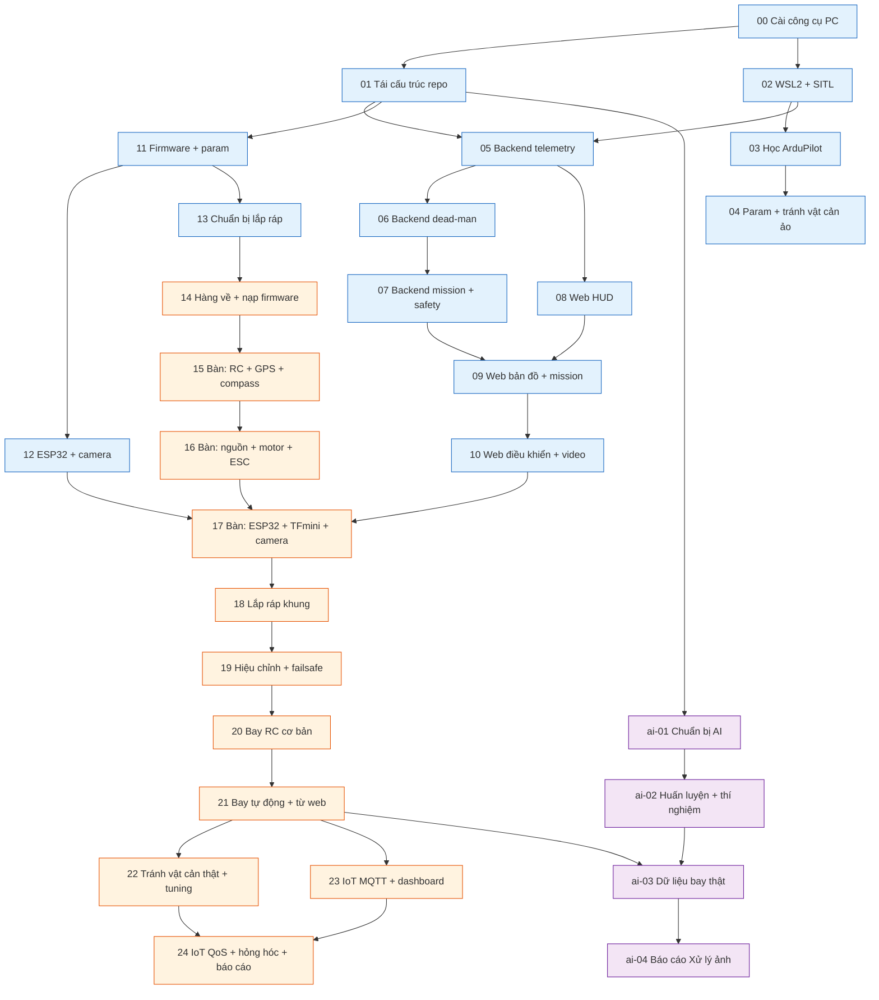

# Kế hoạch dự án UAV IoT + Xử lý ảnh

Thư mục này là **kế hoạch đang có hiệu lực** của dự án. Mọi thứ theo dõi bằng file trong repo — không GitHub Projects, không công cụ ngoài.

Mục tiêu: quadcopter tự chế (khung Holybro S500, SpeedyBee F405 V5, ArduCopter 4.7.1 custom build) bay tay bằng RC và bay tự động theo waypoint, tránh vật cản bằng TFmini Plus, điều khiển và theo dõi từ một website tự viết, có camera nhúng gửi ảnh về laptop cho AI nhận diện người. Phục vụ hai môn học: IoT và Xử lý ảnh.

## Đọc theo thứ tự nào

1. **`SAFETY.md`** ở gốc repo — ba luật cứng. Đọc trước tiên, đọc lại trước mỗi phase có phần cứng.
2. **File này** — hiểu 29 phase và hai luồng.
3. **`plans/_phase-index.md`** — bảng đánh số gốc (SSOT). Nếu file này và index lệch nhau thì **index đúng**.
4. **`plans/PROGRESS.md`** — đang ở đâu, còn gì chưa xong.
5. **`plans/phase-NN-<slug>.md`** của phase đang làm — đọc **trọn vẹn** trước khi gõ lệnh đầu tiên.
6. **`docs/so-tay/NN-<slug>.md`** — nếu có chỗ không hiểu. Sổ tay giải thích khái niệm cho người chưa biết gì; file phase chỉ nói làm gì.

Hai file cần biết là có:

- **`plans/QUYET-DINH-CHUA-CHOT.md`** — hai quyết định còn để mở: **mua camera nào** và **đề tài môn Xử lý ảnh là gì**. Chúng không chặn Phase 00–13; chốt trước khi mua thêm linh kiện (Phase 13) và trước khi bắt đầu thí nghiệm AI (ai-02).
- **`plans/reports/`** — bốn báo cáo nghiên cứu và một bản thiết kế tổng thể, ngày 21/09/2026. Mỗi file phase đều trích dẫn chúng; không cần đọc hết trước.

## Cách đọc một file phase

Mọi file phase theo đúng `plans/_phase-template.md`:

| Mục | Dùng để làm gì |
|---|---|
| Bảng đầu file | Phụ thuộc phase nào, ước lượng bao nhiêu giờ, có cần phần cứng không |
| **Mục tiêu** | Xong phase này thì hệ thống làm được gì |
| **Đầu vào cần có** | Phải đọc gì, phải có sẵn gì trước khi bắt đầu |
| **File và thư mục sở hữu** | Danh sách đường dẫn phase này được sửa. **Không đụng file ngoài danh sách** |
| **Việc theo thứ tự** | Từng bước, mỗi bước có lệnh (ghi rõ chạy ở PowerShell hay bash trong WSL), kết quả mong đợi, và 2–3 lỗi hay gặp |
| **Cổng pass** | Checklist kiểm chứng được. Chưa tick hết thì phase chưa xong |
| **Rủi ro** | Bảng chấm điểm khả năng × ảnh hưởng. Điểm ≥ 15 là rủi ro cao, phải xử lý trước khi bắt đầu |
| **Timeline** | Ước lượng giờ từng việc |
| **Ghi chú cho sổ tay** | Khái niệm cần giải thích, đầu vào cho `docs/so-tay/` |

Ba quy tắc khi làm:

- **Mỗi khối lệnh đều ghi rõ chạy ở đâu** — `PowerShell (Windows)` hay `bash trong WSL`. Nhìn dòng đó trước khi dán. Đây là chỗ sai nhiều nhất.
- **Chỗ nào ghi "chưa xác minh"** nghĩa là chưa ai kiểm chứng trên máy này. Đừng tin, hãy thử và ghi lại kết quả thật.
- **Không tick cổng pass khi chưa thấy bằng chứng.** Nếu một cổng phải hoãn, ghi rõ lý do vào `PROGRESS.md` thay vì tick bừa.

## Hai luồng

**Luồng chính (Phase 00 → 24)** — mục tiêu: UAV bay được, đầy đủ tính năng, web GCS hoạt động, IoT chạy. Chạy tuần tự theo cột "Phụ thuộc".

**Luồng AI (`plans/ai/`, ai-01 → ai-04)** — mục tiêu: model nhận diện người từ trên cao và các thí nghiệm cho môn Xử lý ảnh. Đây là **luồng phụ**: nó không chặn luồng chính, và luồng chính không chờ nó.

Về mặt kỹ thuật `ai-01` chỉ cần Phase 01 (repo đã có `uv`), nên chạy được rất sớm. Nhưng về mặt **thứ tự ưu tiên**: chỉ nên bắt tay vào luồng AI khi luồng chính đã qua **Phase 21** (drone bay tự động và từ web ổn) hoặc khi bạn có thời gian rảnh xen kẽ. Lý do: luồng AI tốn nhiều giờ GPU và không giúp con drone bay sớm hơn một ngày nào. Riêng `ai-03` (thu dữ liệu bay thật) **bắt buộc** chờ Phase 21 vì cần drone bay được từ web.

Ranh giới phần cứng trong luồng chính: **Phase 00–13 không cần một linh kiện nào** (trừ 13.6 tập hàn: mỏ hàn + dây thừa) (làm hết trên PC trong lúc chờ hàng về). Từ **Phase 14** trở đi cần phần cứng thật, và luật `NO PROPELLERS` trong `SAFETY.md` áp dụng cho Phase 14 đến hết bước 19.12 (cánh chỉ gắn ở 19.13).

## Bảng phase

Nguồn: `plans/_phase-index.md`. Cột "Giờ" là **ước lượng cho người mới**, không phải cam kết. Giá trị lấy nguyên văn từ hàng `Tổng` trong mục Timeline của từng file phase — **hàng `Tổng` của mỗi file phase là SSOT duy nhất cho số giờ**; nếu bảng dưới đây và file phase lệch nhau thì file phase đúng.

### Luồng chính

| # | File | Tên | Phần cứng | Phụ thuộc | Giờ |
|---|---|---|---|---|---|
| 00 | `phase-00-cai-cong-cu-pc.md` | Cài công cụ trên Windows: Mission Planner, MAVProxy, STM32CubeProgrammer, VS Code + PlatformIO, Arduino IDE (tuỳ chọn), esptool, kiểm uv/pnpm/Docker | Không | – | 2,5 |
| 01 | `phase-01-tai-cau-truc-repo.md` | Tái cấu trúc repo: `firmware/`, `docs/archive`, khung `docs/so-tay`, pyproject + uv, scaffold Vite, docker-compose mosquitto, CI, PROGRESS | Không | 00 | 6,0 |
| 02 | `phase-02-wsl2-sitl.md` | WSL2 mirrored networking, clone + build ArduPilot Copter-4.7.1, `sim_vehicle`, Mission Planner nối SITL, MAVProxy cơ bản | Không | 00 | 5,0 |
| 03 | `phase-03-hoc-ardupilot-drone-ao.md` | Học ArduPilot trên drone ảo: modes, arm/pre-arm, mission bằng Mission Planner, RTL/Land, đọc log UAV Log Viewer, bài tập tay | Không | 02 | 6,0 |
| 04 | `phase-04-param-va-tranh-vat-can-ao.md` | Nạp thử param base/avoid vào SITL, rangefinder + proximity ảo, thấy AVOID/BRAKE và OA hoạt động, ghi lại param SITL từ chối | Không | 03 | 5,0 |
| 05 | `phase-05-backend-mavlink-telemetry.md` | Backend: lớp kết nối MAVLink, stream rate, model telemetry, WebSocket + **hợp đồng WS** (SSOT cho web) | Không | 01, 02 | 10 |
| 06 | `phase-06-backend-dieu-khien-deadman.md` | Backend: mode/arm/takeoff, GUIDED velocity, dead-man 300 ms (bảo đảm ≤ 350 ms, xem phase-06 §6.4), web-control-enable, 3 test dead-man | Không | 05 | 10 |
| 07 | `phase-07-backend-mission-proximity-safety.md` | Backend: mission validate/upload/readback/AUTO, proximity + AVOID state, safety state machine, REST, coverage ≥ 80% | Không | 06 | 14 |
| 08 | `phase-08-web-khung-hud.md` | Web: cấu trúc Vite/React, store, ws client, HUD telemetry, connection bar, event log, build và serve từ FastAPI | Không | 05 | 12 |
| 09 | `phase-09-web-ban-do-mission.md` | Web: Leaflet map, drone marker, trail, home, geofence, mission editor + upload + readback | Không | 07, 08 | 12 |
| 10 | `phase-10-web-dieu-khien-obstacle-video.md` | Web: WASD/gamepad manual, mode/arm panel, obstacle panel, video panel + overlay (nguồn giả), Playwright E2E dead-man | Không | 09 | 14 |
| 11 | `phase-11-firmware-ardupilot-param.md` | Giải nén custom build, xác nhận feature, quy ước params `00..07`, `01-base.param`, `02-avoid-tfmini.param`, cách rebuild trên custom.ardupilot.org | Không | 01 | 4,5 |
| 12 | `phase-12-firmware-esp32-camera.md` | DroneBridge tải + cấu hình sẵn, project PlatformIO camera (2 env), script bench TFmini, hotspot laptop + firewall | Không | 11 | 6,5 |
| 13 | `phase-13-chuan-bi-lap-rap.md` | Checklist đấu dây từng connector F405 V5, danh sách mua thêm + câu hỏi cho shop, sơ đồ bố trí khung S500, in checklist, tập hàn | Không | 11 | 5,3 |
| 14 | `phase-14-hang-ve-nap-firmware.md` | Kiểm hàng, chụp ảnh, DFU nạp `arducopter_with_bl.hex`, Mission Planner nhận board, kiểm `PRX1_TYPE`, lưu `00-after-flash` + nạp `01-base` | **Có** | 13 + hàng về | 3,5 |
| 15 | `phase-15-ban-rc-gps-compass.md` | Bind FS-i6X/iA6B, iBUS trên R6, radio calib, switch map, RC failsafe; GPS M10 + compass I2C, fix, orient; param `02-radio`, `03-gps` | **Có** | 14 | 4,2 |
| 16 | `phase-16-ban-nguon-motor-esc.md` | Continuity, smoke stopper, cắm pin lần đầu, hiệu chỉnh điện áp bằng đồng hồ, motor test **không cánh**, thứ tự/chiều quay, DShot300, ESC telemetry | **Có** | 15 | 5,0 |
| 17 | `phase-17-ban-esp32-tfmini-camera.md` | ESP32 DevKit + DroneBridge lên SERIAL2, Mission Planner không dây, backend đổi SITL→thật, TFmini bench + SERIAL3 + obstacle panel trên web, camera stream lên web | **Có** | 16 + 10 + 12 | 6,8 |
| 18 | `phase-18-lap-rap-khung.md` | Lắp khung S500, hàn power board, nối dài dây motor 16AWG, bát chống rung, đi dây, GPS mast, mount TFmini, ESP32/camera/UBEC, cân bằng CG | **Có** | 17 | ~16,0 |
| 19 | `phase-19-hieu-chinh-tren-khung-failsafe.md` | Power-on trên khung, accel 6 vị trí, compass ngoài trời, radio recheck, kiểm lại chiều motor, failsafe pin/RC/GCS, geofence, pre-arm sạch, gắn cánh đúng chiều | **Có** | 18 | ~13,0 |
| 20 | `phase-20-bay-rc-co-ban.md` | F1 Stabilize hover, F2 AltHold, F3 Loiter, F4 RTL; đọc log sau mỗi bài (rung, EKF, compass, pin); param `04`, `05` | **Có** | 19 | ~14,5 |
| 21 | `phase-21-bay-tu-dong-va-web.md` | F5 Auto từ Mission Planner, F6 Guided/Auto từ web, F7 web manual 0,5 m/s, F8 RC override; param `06` | **Có** | 20 | ~18,0 |
| 22 | `phase-22-tranh-vat-can-that-va-tuning.md` | F9 AVOID với vật cản giả ở Loiter, OA BendyRuler ở bãi rộng, harmonic notch từ ESC RPM, chỉnh `AVOID_*` / `OA_*` | **Có** | 21 | ~18,5 |
| 23 | `phase-23-iot-mqtt-su-kien-dashboard.md` | mosquitto, topic/payload, publisher, pipeline sự kiện phát hiện (detector bất kỳ), chiếu toạ độ, marker trên map, IoT panel | **Có** | 21 | 25 |
| 24 | `phase-24-iot-qos-hong-hoc-bao-cao.md` | Vòng QoS `jpeg_quality` + thí nghiệm IoT, 5 bài test hỏng hóc, quy ước logging, `07-final.param`, báo cáo IoT + demo + định nghĩa hoàn thành | **Có** | 22, 23 | 44 |

Tổng luồng chính: **~281 giờ**.

### Luồng AI (`plans/ai/`)

| # | File | Tên | Phần cứng | Phụ thuộc | Giờ |
|---|---|---|---|---|---|
| ai-01 | `ai/ai-phase-01-chuan-bi.md` | Chuẩn bị AI: torch cu130, VisDrone-person, Label Studio, DVC, pipeline suy giảm ảnh, parser MJPEG, script train/eval | Không | 01 | 30,5 |
| ai-02 | `ai/ai-phase-02-huan-luyen-thi-nghiem.md` | Huấn luyện + thí nghiệm: Model A/B/D, export, SAHI, ma trận thí nghiệm theo đề tài đã chốt | Không | ai-01 | 45 |
| ai-03 | `ai/ai-phase-03-du-lieu-that.md` | Thu dữ liệu bay thật, ảnh cặp xấu/đẹp, gán nhãn, DVC push, đánh giá lại trên dữ liệu của mình | **Có** | 21, ai-02 | ~52 |
| ai-04 | `ai/ai-phase-04-bao-cao-xla.md` | Chạy lại thí nghiệm, viết báo cáo môn Xử lý ảnh, demo | Không | ai-03 | ~28 |

Tổng luồng AI: **~155,5 giờ**.

## Đồ thị phụ thuộc

Xanh = làm được trên PC, không cần linh kiện. Cam = cần phần cứng thật. Tím = luồng AI.

**Đường găng** (chuỗi dài nhất, quyết định ngày xong): `00 → 01 → 11 → 13 → 14 → 15 → 16 → 17 → 18 → 19 → 20 → 21 → 22 → 24`. Chú ý Phase 17 gom ba nhánh (16, 10, 12) — muốn không bị kẹt ở đó thì nhánh web (05→10) và nhánh firmware ESP32 (11→12) phải xong **trước khi** hàng về.

**Chạy song song được:** `02` với `01` · nhánh backend/web `05→10` với nhánh firmware `11→13` · toàn bộ luồng AI với mọi thứ.

## Trạng thái

Xem `plans/PROGRESS.md`. Cập nhật nó **cùng commit** với công việc tương ứng, prefix `chore(plans):`.
